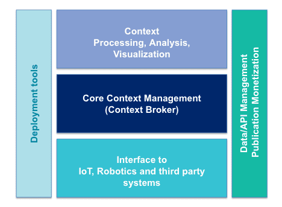
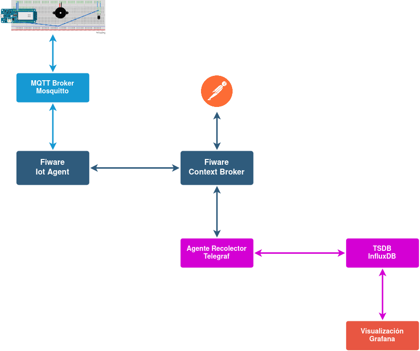
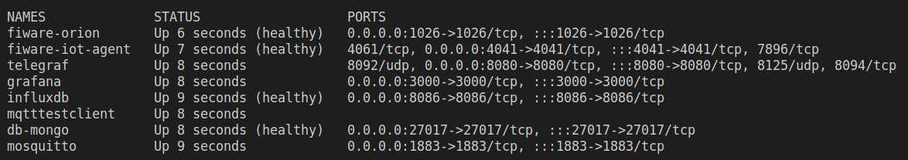
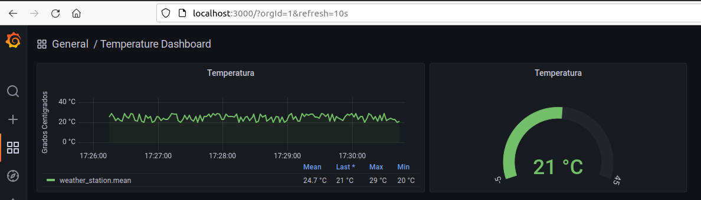

# Prueba de concepto tecnología FIWARE

Proyecto asignatura *Sistemas Empotrados y Ubícuos*. \
Alumno [Francisco Saucedo](https://www.linkedin.com/in/franciscosaucedo/). \
[Máster Universitario en Ingeniería Informática](https://www.upo.es/postgrado/Master-Oficial-Ingenieria-Informatica/). \
[Universidad Pablo de Olavide](https://www.upo.es).

## Contenido

* [Objetivo](#objetivo).
* [Introducción a FIWARE](#introducción-a-fiware).
* [Alcance de la PoC FIWARE](#alcance-de-la-poc-fiware).
* [Arquitectura de la PoC FIWARE](#arquitectura-de-la-poc-fiware).
  * [Requisitos](#requisitos).
  * [Uso](#uso).
  * [Pruebas mediante Postman](#pruebas-mediante-postman).
* [Componentes](#componentes).
  * [FIWARE Context Broker](#fiware-context-broker).
  * [FIWARE IoT Agent](#fiware-iot-agent).
  * [Arduino](#arduino).
  * [Telegraf & InfluxDB](#telegraf--influxdb).
  * [Grafana](#grafana).
* [Conclusiones](#conclusiones).

## Objetivo

Explorar la tecnología *IoT Smart Solutions* [FIWARE](https://www.fiware.org/) mediante una prueba de concepto básica, aplicando también los conocimientos adquiridos en la asignatura.

## Introducción a FIWARE

FIWARE se puede definir como un [conjunto de componentes software de código abierto](https://www.fiware.org/developers/catalogue/) que se pueden ensamblar para construir soluciones inteligentes, basadas en IoT, de una manera rápida, fácil y, por lo tanto, económica.

El principal y único componente obligatorio de cualquier plataforma o solución "*Powered by FIWARE*" es el [FIWARE *Context Broker*](https://github.com/telefonicaid/fiware-orion/), que proporciona una función fundamental requerida en cualquier solución inteligente: la necesidad de administrar, actualizar y proporcionar acceso a la **información de contexto**. Las entidades que forman este contexto pueden ser, por ejemplo, dispositivos IoT, que proporcionan información sobre el entorno y/o pueden actuar sobre el mismo. La gestión del contexto se hace mediante el [API NGSI v2](http://fiware.github.io/specifications/ngsiv2/stable/).

El uso de este API estándar FIWARE por parte de las aplicaciones puede proporcionar los siguientes beneficios:

* Desacoplamiento entre la solución y los dispositivos IoT.
* Portabilidad, con aplicativos que funcionarán de igual forma en diversos entornos. Ciudades distintas, por ejemplo.
* Posibilidad de desarrollo de una *economía de datos*, con organizaciones pertenecientes a diferentes dominios que pueden compartir datos de una manera estándar, en beneficio mutuo.

La siguiente figura muestra la **arquitectura general de FIWARE**:



Este [vídeo](https://www.youtube.com/watch?v=97JsnnpPLrA) proporciona una muy buena introducción a FIWARE. Los [tutoriales *Step-by-step for NGSI v2*](https://fiware-tutorials.readthedocs.io/en/latest/) son realmente interesantes a la hora de aprender esta tecnología.

## Alcance de la PoC FIWARE

Esta prueba de concepto (PoC) cubre el siguiente alcance:

1. **Integración de un dispositivo de baja potencia IoT *Arduino***, que proporciona datos sobre el entorno y puede actuar sobre el mismo.
2. **Montaje de los componentes FIWARE**, que permiten gestionar el contexto y desacoplar los aplicativos de los dispositivos IoT.
3. **Procesamiento, análisis y visualización de datos mediante componentes de terceros**, lo que demuestra la capacidad de FIWARE para integrarse con tecnologías ajenas al *stack* de habilitadores que propone.

Al tratarse de una PoC, no se tratan aspectos que sí deben considerarse en un sistema de producción, como la elasticidad y solidez de la solución, o la seguridad.

## Arquitectura de la PoC FIWARE

Esta Prueba de concepto utiliza [*Docker Compose*](/docker/docker-compose.yml) para montar la siguiente arquitectura:



La PoC se compone de una placa *Arduino* con un sensor de temperatura y una alarma. El programa envía mediciones de temperatura al *broker* MQTT, tomando información del entorno, y se suscribe a comandos para hacer sonar la alarma, actuando sobre el entorno. Los datos de temperatura son recibidos en el *IoT Agent*, que los pasa al *Context Broker*. Éste no almacena información histórica, para ello es necesario una base de datos de series temporales, que captura la información mediante un agente. Los datos almacenados en BBDD son mostrados en un *dashboard* por la herramienta de visualización. Por último, mediante *Postman*, vía API NGSI v2, se puede explorar la información de contexto y enviar comandos para hacer sonar la alarma.

### Requisitos

Para ejecutar esta PoC son necesarios los siguientes elementos tecnológicos:

* [*Arduino* MKR1000](https://arduino.cl/producto/kit-arduino-mkr-iot/) (no es imprescindible, se proporciona un contenedor con un simulador).
* [*Bash shell*](https://en.wikipedia.org/wiki/Bash_(Unix_shell)) (Los usuarios de Microsoft Windows pueden usar [*Cygwin*](http://www.cygwin.com/) para ejecutar scripts bajo este shell).
* [*Docker*](https://www.docker.com/).
* [*Docker Compose*](https://docs.docker.com/compose/).
* [*Postman*](https://www.postman.com/).

### Uso

Para crear la arquitectura de contenedores antes mencionada, se debe ejecutar el siguiente comando:

```
./services.sh start
```

Al iniciar, se carga una [información de contexto básica](/scripts/import-initial-context-data.sh) para que la PoC comience de una forma totalmente operativa.

Si no se dispone de *Arduino*, se puede utilizar un contenedor de test, que simula las tareas encomendadas a éste. Para ello, se tiene que añadir la opción *test* al comando anterior:

```
./services.sh start test
```

En consola se verá un resultado similar al siguiente:



Pasado un minuto, el sistema debería tener datos que se podrán visualizar en [http://localhost:3000](http://localhost:3000):



Se pueden parar y eliminar los componentes de la PoC mediante el siguiente comando:

```
./services.sh stop
```

### Pruebas mediante Postman

He creado una [colección con diversas llamadas de prueba al API NGSI v2](/postman/FIWARE%20NGSI%20API%20Examples.postman_collection.json), que puede ser importada en la herramienta *Postman*. La siguiente figura muestra a la izquierda el conjunto de llamadas disponibles y un ejemplo, que proporciona los datos de la instalación del *Context Broker*:


## Componentes

### FIWARE Context Broker

Como se ha mencionado en el apartado [Introducción a FIWARE](#introducción-a-fiware), el [*Context Broker*](https://github.com/telefonicaid/fiware-orion/) es el núcleo de esta tecnología, proporcionando una [API *Restful*](http://fiware.github.io/specifications/ngsiv2/stable/), simple pero poderosa, que permite realizar actualizaciones, consultas o suscribirse a cambios en la información de contexto. En la [colección *Postman* de la PoC](/postman/FIWARE%20NGSI%20API%20Examples.postman_collection.json) figuran algunos ejemplos de llamadas al API. Por otro lado, el [*script* de carga de datos inicial](/scripts/import-initial-context-data.sh) contiene las llamadas que crean el contexto básico de la PoC. Por ejemplo, estaciones meteorológicas:


Y sensores de temperatura asociadas a éstas:


Es recomendable que las entidades de contexto sigan un [*Smart Data Model* estándar](https://www.fiware.org/smart-data-models/). Al ser una PoC muy básica, en el presente trabajo he creado un modelo específico muy simple, que se puede ver en las llamadas de la [colección *Postman* de la PoC](/postman/FIWARE%20NGSI%20API%20Examples.postman_collection.json). Por ejemplo, estaciones meteorológicas:


Como se puede ver en la [definición de contenedores de la PoC](/docker/docker-compose.yml), el *Context Broker* almacena la información de contexto en una base de datos documental *NoSQL MongoDB*. En este punto, se debe tener en cuenta que:

* No se almacenan datos históricos. Si, por ejemplo, los datos de temperatura van cambiando, se guarda el último valor recibido. Si, como es lógico, queremos analizar la evolución de estos valores, deberemos suscribirnos a los cambios y procesarlos con otro componente, [como se ve en la presente PoC](#telegraf--influxdb).
* Aunque las entidades pueden tener relaciones, no se puede hacer *join* de las entidades de contexto al estilo de las bases de datos relacionales (revisar atributo *refWeatherStation* en las entidades de tipo *TemperatureSensor* y *AlarmActuator*). Para obtener la información de estas entidades relacionadas, se deben hacer diversas llamadas al API, usando como base los atributos de relación.

### FIWARE IoT Agent

Este componente desacopla a los dispositivos físicos del resto de la arquitectura, existiendo distintos agentes que adaptan diversos protocolos e incluso la posibilidad de desarrollar uno propio, tal y como se puede leer en la [documentación sobre componentes](https://www.fiware.org/developers/catalogue/) (apartado *Interface with IoT, Robots and third-party systems*).

En la PoC se utiliza el [*IoT Agent for the Ultralight 2.0 protocol*](https://github.com/telefonicaid/iotagent-ul/blob/master/README.md), asociado a un *broker* MQTT [*Mosquitto*](https://mosquitto.org/), al *Context Broker* y a la BBDD *MongoDB*, como repositorio de información (revisar la [definición de contenedores](/docker/docker-compose.yml)). De forma que el *IoT Agent* recibe datos de *Arduino*, a través de *Mosquitto*, en un protocolo muy ligero, *Ultralight 2.0*, destinado para dispositivos de baja potencia, y los convierte en llamadas de actualización de contexto al API NGSI v2 estándar publicada por el *Context Broker*.
Por otro lado, el *Context Broker* transmite llamadas de las aplicaciones al *Iot Agent* con comandos para los actuadores (formato NGSI), los convierte a *Ultralight 2.0* y los publica en el *broker* MQTT para que los lea y procese *Arduino*. De esta forma, los aplicativos finales se aislan de los dispositivos, utilizando sólo el [API NGSI v2](http://fiware.github.io/specifications/ngsiv2/stable/).

La [colección *Postman* de la PoC](/postman/FIWARE%20NGSI%20API%20Examples.postman_collection.json) contiene diversos ejemplos con llamadas para interactuar tanto con el *IoT Agent* directamente, como con el contexto de sensores y actuadores en el *Context Broker*. Por ejemplo, obtener información sobre los sensores de temperatura cercanos a un punto geolocalizado:


Otro ejemplo lo tenemos en un comando para hacer sonar una alarma:


Por otro lado, en el [*script* de carga de datos inicial](/scripts/import-initial-context-data.sh), que, como se ha mencionado antes, contiene las llamadas que crean el contexto básico de la PoC, están las correspondientes a sensores y actuadores.

## Arduino

He utilizado para esta PoC el [*bundle Arduino* MKR1000](https://arduino.cl/producto/kit-arduino-mkr-iot/) propuesto en la asignatura, con un montaje que contiene un sensor de temperatura y, como actuador, una alarma:


Se tiene que tener en cuenta en este punto, que el objetivo de la PoC es explorar la tecnología FIWARE, no disponer de un montaje físico complejo.

El [*sketch Arduino*](/arduino/fiware-iot-upo.ino) se conecta a una red WiFi y publica datos de temperatura, en formato *Ultralight 2.0*, vía MQTT. Por otro lado, se suscribe a un tópico del que recibe comandos para hacer sonar la alarma. En la interfaz serie se puede ver el registro de su trabajo:


Como se ha mencionado en el apartado [*Uso*](#uso), si no se dispone del *bundle Arduino*, puede utilizarse la PoC mediante el contenedor simulador proporcionado. Así, ejecutando en una consola el comando:

```
docker logs mqtttestclient
```

Obtenemos el log de este contenedor de test, con registro de las temperaturas que va enviando y los comandos que recibe:


### Telegraf & InfluxDB

Como se ha mencionado antes, el *Context Broker* no almacena información histórica. Para ello, debemos suscribirnos a los cambios y utilizar otros componentes para procesar los datos recibidos.

Los [habilitadores genéricos que propone FIWARE para almacenar datos de sensores en series temporales](https://fiware-tutorials.readthedocs.io/en/latest/time-series-data.html) son [*QuantumLeap*](https://quantumleap.readthedocs.io/en/latest/) y [*CrateDB*](https://crate.io/). Con objeto de demostrar la capacidad de FIWARE para integrarse con tecnologías ajenas al *stack* de habilitadores que propone, he optado por explorar la integración con la base de datos de series temporales (TSDB) [*InfluxDB*](https://docs.influxdata.com/influxdb/v2.2/), vía agente [*Telegraf*](https://docs.influxdata.com/telegraf/v1.22/). En este punto, señalar que (en el momento de escribir estas líneas) no existe, o al menos no he encontrado, **documentación específica** sobre cómo integrar FIWARE con *InfluxDB* & *Telegraf*, unas tecnologías que están teniendo gran éxito en el mercado.  

El primer paso para crear esta integración es [configurar *Telegraf*](/config/telegraf.conf) con el plugin [*http_listener_v2*](https://github.com/influxdata/telegraf/blob/release-1.22/plugins/inputs/http_listener_v2/README.md), que publica un servidor HTTP que recibe llamadas del *Context Broker* a través de la suscripción que se configura vía API NGSI v2:


Luego analiza los datos en formato JSON NGSI v2, extrae los atributos necesarios y almacena la información en una serie temporal de *InfluxDB*. El fichero [*telegraf.conf*](/config/telegraf.conf) contiene esta configuración.

Se pueden ver los datos de la serie temporal creada entrando en el contenedor de *InfluxDB* mediante:

```
docker exec -it influxdb /bin/bash
```

Y ejecutando los siguientes comandos:

```
influx

use fiwareiotupo

precision rfc3339

select * from weather_station
```


### Grafana

He creado un *dashboard* básico que lee los datos de la serie temporal almacenada en *InfluxDB*. Esta visualización [se provisiona automáticamente](/grafana/dashboards/temperature-dashboard.json) en el [*script* de *Docker Compose* de la PoC](/docker/docker-compose.yml), estando accesible en [http://localhost:3000](http://localhost:3000):


## Conclusiones

FIWARE es una solución de **código abierto** para construir plataformas IoT **muy sólida**, que **proporciona un amplio conjunto de herramientas**, que **puede integrarse con herramientas de terceros** y que está **muy bien documentada**.

Destaca el API estándar NGSI v2, que permite a las soluciones abstraerse de los elementos IoT.

Por último, señalar que es un *framework* en [**continua evolución**](https://github.com/FIWARE/context.Orion-LD), con una [**amplia comunidad**](https://www.fiware.org/community/fiware-ihubs/), [**casos de éxito interesantes**](https://www.fiware.org/about-us/impact-stories/) y un buen [*marketplace*](https://marketplace.fiware.org/).
